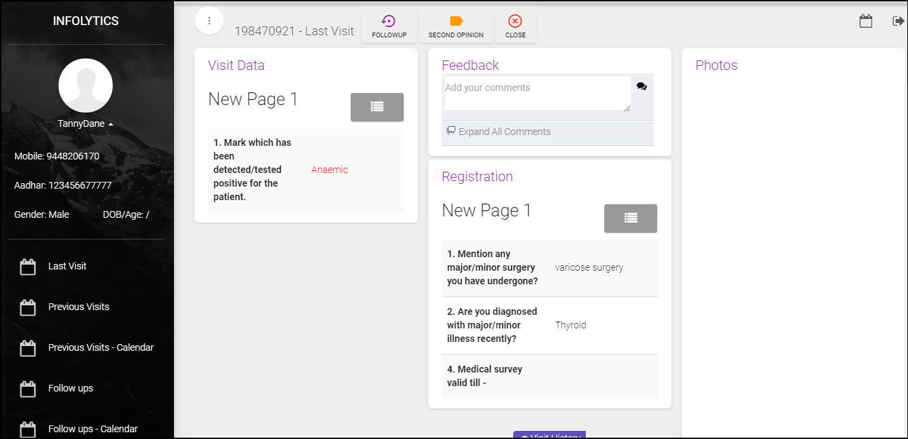
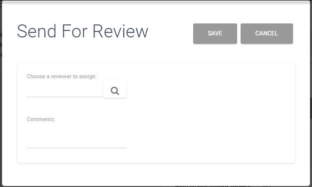

.. role_admin\casestudies:

Case Studies
==========================
.. include:: ../../common/stub-overview.txt

.. |Search| image:: images/searchicon.jpg
.. |Chat| image :: images/chat.jpg

Admin can view case details, documents or reports that are attached and then decide whether a re-visit or review is required. Based on the current status of the visit under the study, the visit can be further processed  depending on the available options which are as tabulated below.  

===================  ============================================================
Summary of Visits             Options available - Action to be taken
===================  ============================================================
New Visit	         
						1. Follow-up: Request re-visit for visits with incomplete data.
						2. Second Opinion: Send case details to other Admins for second opinion. 
						3. Normal: Set case as normal, if no malignancy is found. 
After Follow Up			 - No Options - 
Revisit				 	
						1. Follow-up: Request re-visit for visits with incomplete data.
						2. Second Opinion: Send case details to other Admins for second opinion. 
						3. Normal: Set case as normal, if no malignancy is found. 			
Second Opinion       	
						1. Follow-up: Request re-visit for visits with incomplete data.
						2. Normal: Set case as normal, if no malignancy is found.
Normal 				 	
						1. Follow-up: Request re-visit for visits with incomplete data.
						2. Second Opinion: Send case details to other Admins for second opinion. 
===================  ============================================================

To access a case study:

* On the Home page, select an Ongoing Study. The Home page of the Study is available on screen. 
* Summary tab has consolidated view of all the visits conducted during the survey. Click on required section, visits will be listed below.  
* Choose a visit from the list. The case details for the visit (with current status) is listed on screen. 

Case Visit - Normal
--------------------------
If no issues are seen in the survey or in the documents (reports) attached to the case study, then it can be considered as normal. 

* From the Summary tab, Open New Visit/Revisit to view the Case details form and cick Normal. 
* The count of normal visits will be incremented by 1. 

The visit will be listed under **Normal** tab, **Summary** of the current case study.

.. Note:: *Normal case visits can be re-opened and sent for follow up or for review by other Admin.*

Case Visit - Follow Up
--------------------------
If survey is incomplete or documents attached are not clear, then Admin can send the visit back for follow up. 

* From the summary tab, Open a New Visit/Revisit/Second Opinion/Normal to view case details form.
* Add your comments in the Feedback section of the case details form and click |Chat| Post comment. Comments will be listed and available to all users accessing the case. 
* Select Follow Up. In the create Follow Up form, click |search| of Follow Up By text box, and add user (generally admin). 
* Add notes (if any) in the Observation text box and click Save. 

The visit will be listed under **Follow Up** tab, **Summary** of a case study and count of Follow Up visits will be incremented by 1. Case will also be listed under **Upcoming Follow Ups** or **Delayed Follow Ups** depending on the follow up date.  

.. Note:: *After re-visits are created by the assigned field user, the visit will be listed under the ReVisits, Summary tab of the related case study.* 

Case Visit - Second Opinion
------------------------------
If case as not normal or Admin has found issues in the documents (reports) then case can be referred to another Admin for second opinion.

* From the Summary tab, Open a New Visit/Revisit/Second Opinion/Normal to view Case details form.
* Add your comments in the Feedback section of the case details form and click |Chat| icon. Comments will be listed and available to all users accessing the case. 
* Click Second Opinion. In the Send for Review form, click |Search| in the Choose a reviewer to assign text box and add a user.   

* Add your opinion about the case in the Comments text box and click Save.

The case will be listed for the selected Admin login and count of visits for **Second Opinion** will be incremented by 1 on the **Summary** of the Study.

..  Note:: * When case is marked for review (or second opinion) for other Admin, he can either create a follow up or mark it as normal.* 
