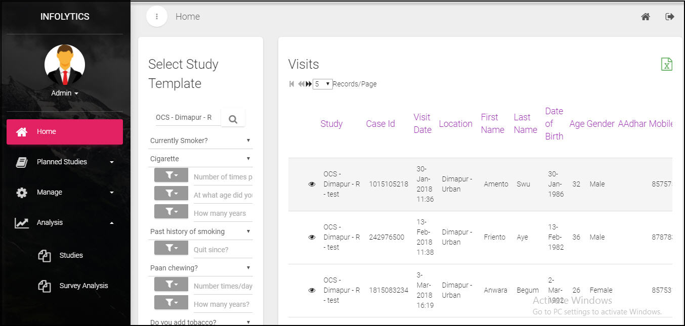

.. role_admin\surveyanalysis:

Survey Analysis
==========================
.. include:: ../../common/stub-overview.txt

Survey Analysis can be conducted for:

1. All Studies  
2. A Study associated to a Study Template

Survey Analysis - All Studies
------------------------------

The current status of case studies of all visits created under all studies can be analyzed by a  Super 

Admin.

To view analysis of all studies associated to a study template:

* On the Home page, Go to Analysis menu and click Survey Analysis. 
* Click |Search| of Study Template, select and add a template from the list. 
* From the questionnaire listed below, choose filter options from the drop-down and click Search. 

All case visits satisfying the search criteria will be listed on screen. 

Here is a sample data to view survey analysis of case studies of all individuals who smoke cigarettes. 

Survey Analysis - A Study
------------------------------

The current status of case studies of all visits created under a study can be analyzed by an Admin. 

To  view analysis of a study associated to a Study Template:

* On the Home page, select a Study, Go to Analysis menu and click Survey Analysis. 
* Questions from the associated survey template will be listed below, choose filter from the drop-down and click Search. 

All case visits satisfying the search criteria will be listed on screen. 

