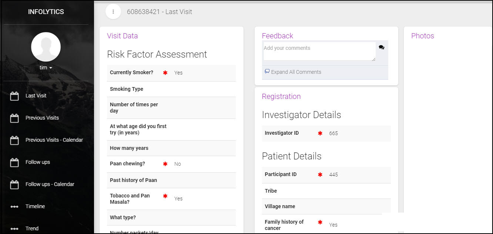
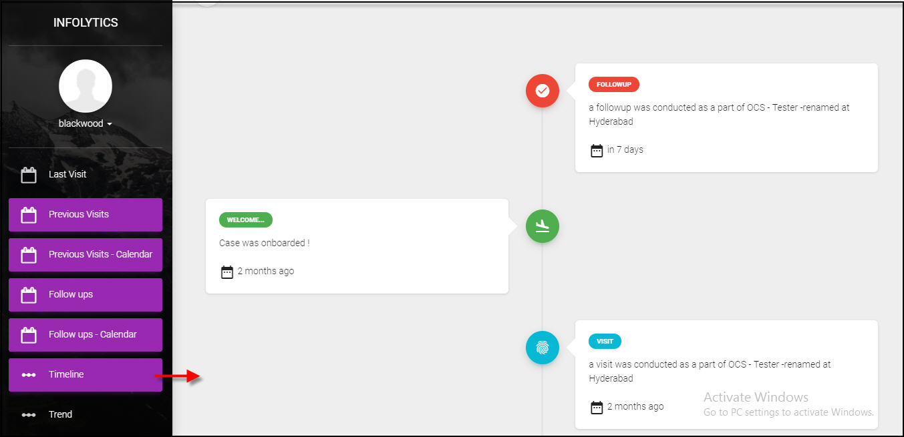

.. role_admin\\uiadmin:

Know your Interface 
==========================

.. include:: ../../common/stub-overview.txt

Infolytics has interface screens specific to the role.  User interface screens related to an Admin are as listed below. 

Home 
--------------------------

Studies for which an Administrator is assigned with role permissions are listed on screen.

* Enter your login credentials to open the application Home page that displays Ongoing Studies associated to a user.
* Select a Study and click |View|View icon. The Home page of the study is available on screen.  

**Home Table**:

===================  ============================================================
 Menu Options        Description
===================  ============================================================
Home                 Summary: Shows count of new visits, re-visits, Follow Ups, second opinion, duplicate and normal visits.
					 * New Visits: Shows list of all new visits created under the study.
					 * Revisits: Shows visits for which follow up is complete.
					 * Second Opinion: Shows list of visits to be reviewed.
					 * Potential Duplicates: List visits that share the same data. 
					 * Follow up: Shows list of visits pending for follow up.
					 * Normal: Display visits that are considered normal.

New Visit            Show  new visits uploaded by field users along with details.
Scheduled Follow Up  Shows visits that are pending for follow up, field user has to complete follow up before the mentioned date. 
Follow Up Calendar   The study schedule dates are marked on the calendar for today or current month, day or week.     
Visit Maps           Activates Google Maps to point to the exact location where the survey is being conducted. 
Survey Analysis   	 Data of visits based on the search criteria chosen or entered by the user is displayed for the study.
===================  ============================================================

View Survey Details - Case Study 
-----------------------------------

Coordinator can view survey details of:  
    1. New visits and 
    2. Visits scheduled for Follow Up 

* Select a new visit from the Home page of a Study. Or
* Choose a visit from the Scheduled for Follow Up menu of a Study. 
  The Home page of the last visit (with case Id) is displayed on screen.

The menu options are as tabulated below:

**Visit Details Table**:

====================  ============================================================
 Menu Options         Description
====================  ============================================================
Last Visit            Shows survey details of the case study for last visit or visit marked for Follow Up.  
Previous Visit        Shows list of previous visits by the case, select a case to view the survey details.
Prev Visit Calendar   View dates marked on the Calendar for all previous vists by the case.
Follow Ups	      Displays list of visits (if marked for follow up) for the current case. 
Follow Up Calendar    Displays schedule dates for follow up marked on calendar for the current case.  
Timeline              View current status and past history of a case on the timeline. Refer link:`Timeline - Case Study`_ for details.
Trend		      Shows graphical analysis of survey questions during a case study. Refer the link: `Analysis - Case 		      Study`_ for details.
====================  ============================================================

.. _Timeline - Case Study:

Timeline - Case Study 
-----------------------------------

Coordinator can view various stages undergone by a case along with its present status.  

* Open a Study, select a case and click Timeline.
* On the timeline, you can see all the stages of the current case study.

.. _Analysis - Case Study:

Analysis - Case Study
--------------------------------------

Coordinator can view graphical anaysis of answers provided by the case during the survey.

* Open a Study, select a case and click Trend to view the form.
* To perform analysis a Study, click Search of Study, choose a Study from the list and click Show Trend. 

The trend or analysis of the survey questions for answers provided in the case study are as listed on screen. 
