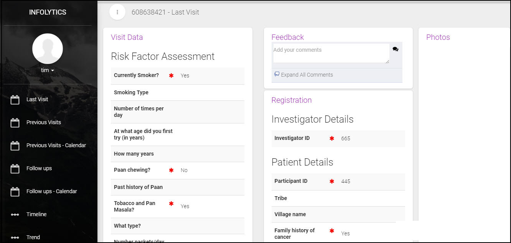
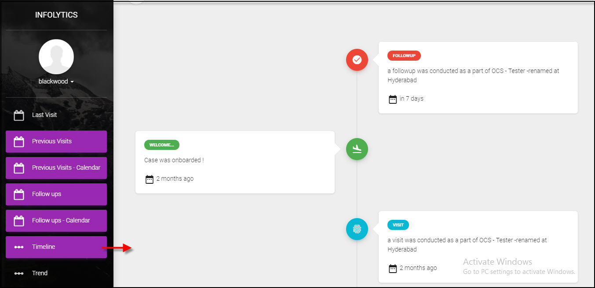

.. role_coordinator\\uicoordinator:

Track Case Studies 
==========================

.. include:: ../../common/stub-overview.txt

Infolytics has customized interface screens for coordinators to track the activities of case studies that is as tabulated below.

.. Note:: *It is basically a read only view for a Coordinator. He can view all the activities of an Admin and a Field User.*

Home 
--------------------------

Studies for which a Coordinator is assigned with role permissions are listed on screen.

* Login as a Coordinator. Home page displays Ongoing Studies associated to a user.
* Select a Study and click |View| icon. Home page of the Study is available on screen.  

**Home Tables**:

===================  ============================================================
 Menu Options        Description
===================  ============================================================
Home                 View all ongoing studies associated to the user. Select a Study, Summary tab will display the following details.
​					 
					 * New Visits: Shows list of all new visits created under the study.
					 * Revisits: Shows visits for which follow-up is complete.
					 * Second Opinion: Shows list of visits to be reviewed.
					 * Potential Duplicates: List visits that share the same data. 
					 * Follow-up: Shows list of visits pending for follow-up.
					 * Normal: Display visits that were considered as normal.

New Visit            Displays new visits synchronized by field users along with details.
Scheduled Follow Up  Shows visits that are pending for Follow Up, field user has to complete Follow Up before the mentioned date. 
Follow Up Calendar   The study schedule dates are marked on the calendar for the current month, day (today), or the week.     
Visit Maps           Activates Google Maps to point to the exact location where the survey is being conducted. 
Survey Analysis      Data of visits based on the search criteria chosen or entered by the user is displayed for the study.
===================  ============================================================

View Details of Case Study 
----------------------------------------

Coordinator can view survey details of  new visits and visits scheduled for Follow Up 

Select a new visit from the Study - Home page of a Study. Or Choose a visit from the Scheduled for Follow Up menu of a Study. The Home page of the Last Visit (with case Id) is displayed on screen.

The menu options are as tabulated below:

**Visit Details Tables**:

===================  ============================================================
 Menu Options        Description
===================  ============================================================
Last Visit            Shows survey details of the case study for last visit or visit marked for Follow Up.
Previous Visit        Shows list of previous visits by the case, select a case to view the survey details.
Prev Visit Calendar   View dates marked on the Calendar for all previous visits by the case.
​Follow Ups			  Displays list of visits (if marked for Follow Up) for the current case.	
Follow Up Calendar    Displays schedule dates for Follow Up marked on calendar for the current case. 
Timeline 			  View current status and past history of a case on the timeline. 
					  Refer:`View Timeline of Case Study`_ for more details.
Trend				  Shows graphical analysis of survey questions during a case study. Refer: `View Analysis of Case Study`_ for more details.
===================  ============================================================

.. _View Timeline of Case Study:

View Timeline of Case Study
---------------------------------------

Coordinator can view various stages undergone by a case along with its present status.  

Open a Study, select a case and click Timeline. On the timeline, you can see the past stages of the current case study.

.. _View Analysis of Case Study:

View Analysis of Case Study
-------------------------------------------

Coordinator can view graphical anaysis of answers provided by the case during the survey.

* Open a Study, select a case and click Trend to view the form.
* Click |Search| of Study, choose a Study from the list and click Show Trend. 

The trend or analysis of the survey questions for answers provided in the case study are listed on screen. 