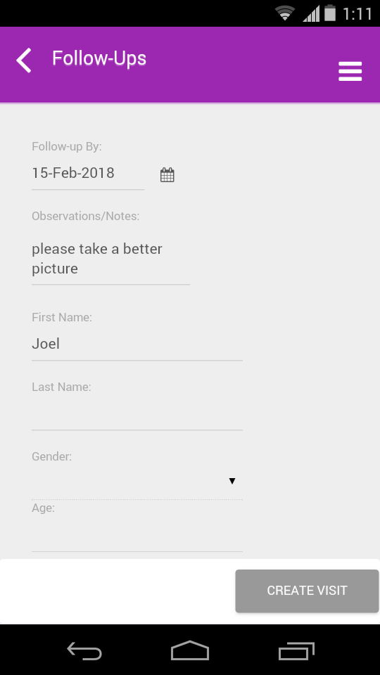

.. role_fielduser\createvisitfollowup:

Create Re-visits 
====================================

.. include:: ../../common/stub-overview.txt

For a study, certain case studies are marked for Follow Up by Admins, if survey is incomplete or documents attached are not clear. Notes are added for appropriate action to be taken while conducting a re-visit.
A field user can create re-visits either in offline or online mode, collect relevant details and documents for case studies that are:

1. **Upcoming**: Follow Up date is ahead of the current date.
2. **Delayed**: Follow Up date has crossed the end date. 

.. Note:: *You cannot edit basic details of the patient.Survey questions will depend on the study template, follow up questionnaire that is attached for the study.*

To create a re-visit for a follow up:

- Go to Upcoming Follow Up/Delayed Follow Up tab, select a Case Study from list of all studies that requires follow up to view the form on screen. Or
- On the Home page, select a Study, tap on Follow up menu to view case studies of current study. Select a case study to view the follow up form (with notes from Admin).

- Tap on Create Visit form, scroll-down to Registration section. In the survey questionnaire form, collect details and mark appropriate choices to each question.
- Additional details of the patient can be added under the Enter Data section. For each question, type in the text using the keypad. 
- Documents relevant to the case i.e., Medical reports, x-rays report etc., can be uploaded or captured as a photograph.
- Scroll-down to the Attachment section, tap on Add Document, browse and select a file from the list, and tap on Add Or 
- Tap on Capture. Take a photograph and tap on Add. A photograph will be attached, Tap on Save to store the changes. 

The case will be listed under **Upcoming Follow Ups** or **Delayed Follow Ups**, where follow up’s for studies are listed on screen.  

.. Note:: *If follow up visit is created during the offline mode then data has to be uploaded to make it available in the web application. Data will be lost, if cache is cleared before upload.*

For more details, refer: `Upload Offline Data <https://../../../uploadofflinedata.html>`_
