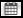
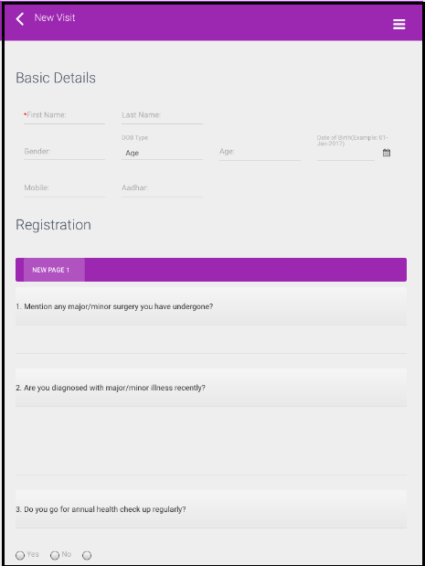
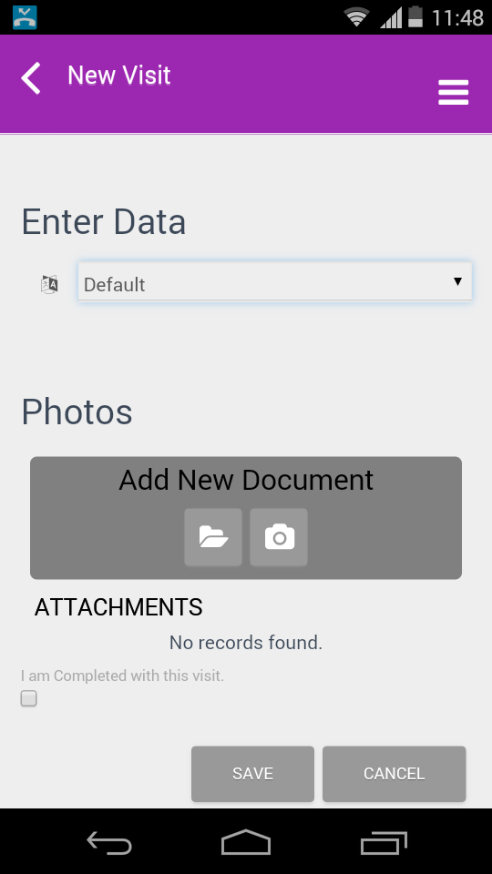
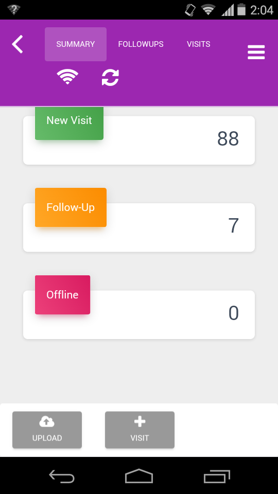

.. role_fielduser\createvisit:

Create New Visit 
==============================

.. include:: ../../common/stub-overview.txt

.. |Capture| image:: images/Captureicon.png

During a case study, survey is conducted to collect details of individuals visiting the medical camp. A field user can create new visits using the App installed on their mobile devices.

Field user can create new visits either in:

1. **Online Mode**: New visits will be published in the web application on save.
2. **Offline Mode**: New visits will be published on save and upload.

.. Note:: *By default, the survey is either in online or offline mode based on the last entry. If study is currently in Online Mode, then Take Offline option will be available on screen.*

* On the Home page of the App, Tap on Camps menu and select a Camp from the list, the Summary tab is available on screen.
* Select |Clear cache| Clear Cache to clear all previous data (if any)

.. Note:: *In Offline mode, if cache is cleared after new visits are created and before data is uploaded then all data will be lost.*

* To create a new visit in the Offline Mode, tap on Take Offline. The App goes in to processing mode fetching all the details. A **Cancel Offline**, **Sync** and **Create Visit** options are available on screen.
* Tap on +Visit. A New Visit form is open where you can add basic details of individuals visiting the camp.

.. Note:: *Admin can create visits from web application. Go to Planned Studies, Listing menu on the Home page, select a Study, and click New Visit.*

* Type in First Name, and Last Name of the person using the Keypad of the mobile. 
* Tap on the drop-down of Gender, select either Male or Female option. 
* If user selects DOB Type as Age from the drop-down then specify the Age. The Date of Birth is auto-calculated and displayed respective text box. 
* Else, if user selects DOB type as Date of Birth from the drop-down, tap on |Calendar| icon, select date, month and year to add the date of birth of the person. The age of the patient will be auto-calculated and displayed on screen. 
* Provide a valid mobile number and a 12-digit Aadhaar card number for identification. 

.. Note:: *While creating a visit in Online mode, if you save the details without conducting registration or follow up survey then you cannot modify or re-take the survey. System will prompt you to take-up the survey only if certain questions are set as mandatory.*

* Scroll-down to the Registration section. A Registration questionnaire (if configured) will be available on screen. 

.. Note:: *The form will have questions that are added in the Survey Template that is associated to the new visit.*

* Collect details and mark appropriate choices for each question listed in the form. 
* Additional details of the patient can be added under the Enter Data section.

* For each question, type in text using the keypad. Documents relevant to the case, for instance, Medical reports, X-ray reports can be uploaded or captured as photograph. 
* On the Create Visit form, scroll-down to the Attachment section, and select Add Document. 
* Tap on|Browse| Browse, select a file from the list, and click Add. Or, Select |Capture|Capture. Take a photograph, and tap on Add. Photograph will be loaded and attached in the form. 
* If survey is completed for the current case study, then select the checkbox, **I have completed this visit and Tap on Save to store the changes.  
* The patient record for the visit will be created and listed under the **Visits** tab. The number of visits will be incremented by 1 under the **Summary** tab. 

Repeat the above steps to add survey details for any number of individuals visiting the camp. 

A case is created in the web application for every visit a field user creates using the App. For visits created in offline mode, a case will be created after data is uploaded.

If survey is conducted in offline mode, refer `Upload Offline Data <https://docs.lmexcellence.com/HelpInfolytics/role_fielduser/uploadofflinedata.html>`_ for more details.

Online visit will be listed under **Planned Studies**, **Listing** menu, **Study** (selected study), **Visit** section. OR **Home**, **Manage**, **Visits**, **New** tab. OR  select a study on the **Home** page, **Summary**, **New Visits** tab. 