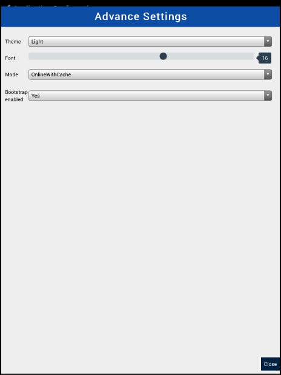

.. mobileappinstall:

Install App 
=====================================

.. include:: ../common/stub-overview.txt

You can access the application either through the website or App (if installed on your mobile device). The App can be downloaded and installed from **Play Store** for Android devices or **App Store** for IOS devices. You can authenticate and configure your device either manually or by scanning the QR code.

.. Note:: *The App can be used on mobile devices with Android version 4.4.5 and above, if installed from Play Store*.

To download and install the App on your mobile:

* Open **Play Store** or **App Store** on your Android or Smart phone.
* Select App from the list, and Tap on Download. App gets downloaded on to your device. 
* Tap on Install. A pop-up message appears to confirm whether App can access your identity and contacts, Tap on Accept.

The device goes into the processing mode and all the application resources will get loaded on the screen.

Log In 
--------------------------

For your account in the web application, you can authenticate your mobile device by:

1. `Scan QR Code`_  
2. `Manual Configuration`_ 

.. _Scan QR Code:

Scan QR Code 
^^^^^^^^^^^^^^^^^^^^^^^^^^

To scan the QR Code:

* Open the web application, click Mobile icon on the Home page. Mobile Apps Store details form with QR Scan code is available on screen.
* From your device, tap on QR Code and Capture the scan code from the screen to authenticate your device.

The App goes in to the processing mode on your device.

.. _Manual Configuration:

Manual Configuration 
^^^^^^^^^^^^^^^^^^^^^^^^^

You can manually configure the app on your device.

* On the App, tap on Manual Configuration. 
* Using the keypad, enter the application link, [Infolytics] (https://ily.apppoint.com)
* Click Next, choose Bizapp as the platform from the drop-down, and click Next. 
* Advanced settings are done to set up the mobile app environment.Tap on Advanced settings icon. 
* On the advanced settings form, configure Theme and Font parameter for type and size from the drop-down to set-up the mobile app environment.

* Configure the mode of adding data, choose either  of the option from the drop-down. 
* Online with cache: Data can be captured and saved only in the  online mode. 
  * Online only: App will be available in the online mode for data capture.
  * Offline only: App will be available in the offline mode for capturing data.  
* Set Bootstrap enabled as **Yes** from the drop-down to allow users to view data on screen.

.. Note:: *If bootstrap enabled is not configured then data will be not be available.A blank page will be visible on screen.*

* Tap on Close to save the settings. 
* To configure user details, type in your login id, password, enterprise id that is already created in the application. 
* Tap on Save. The App goes into the processing mode and loads all the resources from the application which might take a few minutes.
* Tap on Login to open the application.

