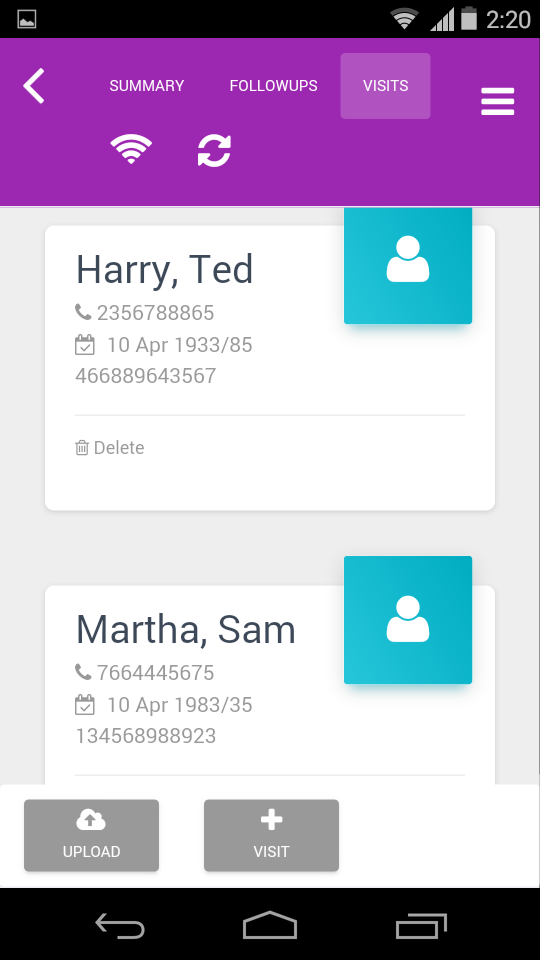

.. role_fielduser\syncofflinedata:

Upload Offline Data
==========================

.. include:: ../../common/stub-overview.txt

.. |Refresh| image:: images/refresh.jpg

Survey visits will not be listed in the web application, when new visits are created in offline mode. Field user has to upload (or synchronise) offline data visits to publish in the web application. 

.. Note:: *If cache is cleared before upload then all the data will be lost.The Upload option will be available only if study is currently in offline mode.*  

To upload offline data:

* Select a Camp on the Home page. Tap on Visits tab on the Study details form. All visits created during the offline survey will be listed on screen.

* Tap on Upload. The application goes in to the processing mode. All visits will be published in the web application.
* Select |Refresh| Refresh. The visits will be removed from the current list. 

New visits will be listed under **Planned Studies**, **Listing** menu, **Study** (select study), **Visit** section. OR  **Home**, **Manage**, **Visits**, **New** tab. OR select a study on the **Home** page, **Summary**, **New Visits** tab.  
