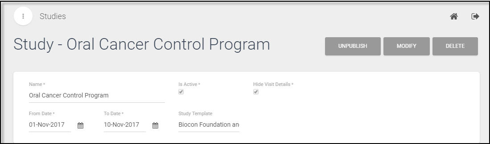
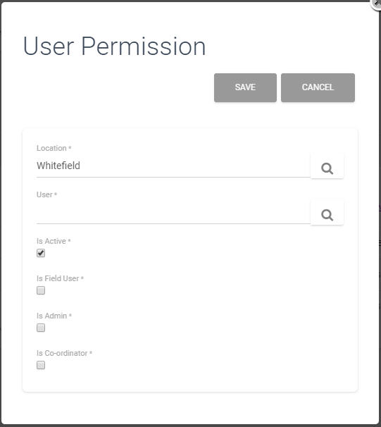

.. role_superadmin\createcasestudy:

Create Study
==========================

.. include:: ../../common/stub-overview.txt

.. |Search| image:: images/searchicon.jpg

Survey is conducted for a case study that is created by associating a case to the study template and by adding  permissions to the users. 

An Administrator can create a new study:

- Go to Registration Survey tab of the Study Template, scroll  to Associate Study section and click Create Study. A study template will be associated to the new study. 

.. sidebar:: Important

   :Note: Not the required Template ?

  Then, Create a new study template, refer link: `Study Template <http://docs.lmexcellence.com/HelpInfolytics/role_superadmin/createstudytemplate.html>`_ or contact the Administrator.

- Specify the begin, end date of the study in the From Date, To Date using the |Calendar| Calendar Icon and click Save.
- The study is marked as **Is Active** and all visit details are hidden by default. 

A study will be created and listed under the list of studies.

Add Location
--------------------------------

A case study is conducted at a particular location. 

To associate a study location for a Study:

- Select a Study, Go to Location section, and select Add Location to view the Study form.
- Click |Search| of Location, select a location from the list, and click Add. The **Is Active** is checked out by default, and click Save. 

The current location will be associated to the study. 

.. Note::*If required location is not in the list, then to create a location refer: `Create New Location <http://docs.lmexcellence.com/HelpInfolytics/role_superadmin/webappui.html#create_study_location>`_ or contact the Administrator.*

Add Users 
--------------------------------

A case study will require users with the role permissions as Admin, Coordinator or a Field User. 

To add a User,

- On the Study form, click Modify, go to User Permission section, and click Add User. The study location will be populated with specified location.

- Click |Search| of User, choose a user, and click Add. Select the **Is Admin** checkbox to associate permission as **Admin **and click Save. The user will be listed under the User Permission section for the current study.  
- Repeat the above steps to add other user, select the **Is Coordinator** checkbox to associate permission as **Coordinator** and click Save. The user will be listed under the User Permission section for the current study.  
- Similarly, add another user, select the **Is Field User** checkbox to associate permission as **Field User**. Click Save. All the associated users will be listed under the User Permission section for the current study. 

.. Note:: *For a  study, any number of users can be added as Field Users and Coordinators.*

Publish the Study
--------------------------------
While creating the study, the study will be in the draft state. It will be available to all only if it is published.

- Open the current Study form, and click Save.
- Select Publish and click Save. An **Un Publish**, **Modify** and **Delete** options are available in the form.

The study will be listed under the **Planned Studies**, **Listing** menu on the application **Home** page.  