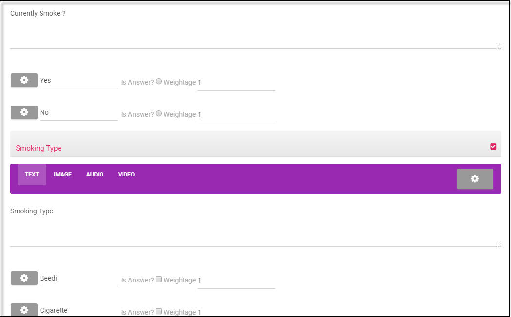

.. role_superadmin\createstudytemplate:

Study Template
==========================

.. include:: ../../common/stub-overview.txt

A Study Template provides users with a basic design to collect details required for the study.  It is designed to procure details of individuals visiting the camp to study their life-style and habits.

Create a Study Template
--------------------------------

Super Admin can create new study templates for users based on the type of study.

* Go to Manage menu on the Home page and select Study Templates. 
* Click Create Study Template. A new study template details form is available on screen. 

.. image:: images/surveytemplate.png

To add template details:

* Under the Template Details tab, provide title and brief information about the template in the Name and Description text box. 
* The **Is Active** is checked out indicating study template is currently available to all. Associate a picture of the study template for identification, and click |Browse| Browse.
* Choose a system file, and click Add. OR Select |External| External link, add a link, and click Upload. Or Select |Capture| Capture, the system camera is turned on, and click Capture. 
* The picture will be uploaded to represent the template. Delete and Preview options are available to view and modify the image. Click Save.

The new study template will be in the draft state.

Survey Questionnaire
--------------------------------

A survey questionnaire is created to register a user and collect details of individuals during a visit based on the  case study.

Registration Survey
^^^^^^^^^^^^^^^^^^^^^^^^^^^^^^^^

Field user  basic details that are required for identification and submits it to the specialist for review.

Follow Up Survey
^^^^^^^^^^^^^^^^^^^^^^^^^^^^^^^^^

For a particular case, if reports are not clear or the case requires immediate attention, then a Follow Up is recommended. Field user has to revisit to collect missing data, create follow up visits and collect relevant details.  

The questionnaire will require the configurations as mentioned below.  

1. Multiple language settings
2. Add questions of single, multiple answer choices, text, number, date and time. 
3. Configure dependent questions, attach documents, image files, video/audio URL for questions.
4. Add comments, hints for answers and highlight answer choices.
5. Support multiline text and add weightages to auto-calculate score based on answer choices. 
6. Show questions based on answers, mark correct answer choices and associate score to each question.

Create Survey Questionnaire
--------------------------------

A questionnaire will require questions, 

To add new questions:

* Open the Survey Template form, click Modify, and select the Registration Survey or Follow Up Survey tab. 
* Click |Settings| Settings icon. All initial settings appear in the drop-down. By default, mode is set as **Page**, language is set as **Default**  for all new questions.  
* To set questions in a another language, click drop-down of Add Language, select a language from the list and click Add Icon. 

The selected languages will be listed under the drop-down of Available Languages and Switch Language. 

Add Page
--------------------------------
On a new page, you can add a new questions, set page order and configure dependent questions. 

* Select Add Page. A new page section with order, dependent question and answer will be available in the form.
* Order is set as 1, by default. Dependent question can be configured after a few questions are added in the form.

.. Note:: *To add dependent questions, Refer to `Dependent Questions`_ for more details.*

Add Questions
--------------------------------
Questions may require answers of type text, alpha-numeric, multiline, number, radio, checkbox, drop-down, date & time, phone, range, calculated and attachment type. 

* Under the Registration/Follow Up tab, select Add Question and choose a Question Type from the drop-down.
* Type in the question in the question text and click + to enter your answer choices. 
* If answer provided is the right answer then select Weightage checkbox, choose a weightage from the drop-down.
* Questions can be based on a **picture** or an **image**, choose a picture or image file from your system files and click upload. Or Specify an image URL to upload the picture. 
* If an audio attachment is provided to support your question, then choose file, select an audio attachment from the list, and click Add. OR Specify an audio URL as an attachment. 
* If a video attachment is provided to support your question, choose a video attachment file from your system, and click Add. OR 
* Specify a video URL from the list, select a video player either YouTube or Vimeo with video ID of that URL. 

Question - Single, Multiline  text
^^^^^^^^^^^^^^^^^^^^^^^^^^^^^^^^^^^^^^^^^^^^^^^^^^
You can add questions that require a single line or multiple line text as input from the keypad.  

- On the Question form, click drop-down of Add Question, and select Text/Multiline. 
- Click New Question. Enter a question that requires user to type in the answers through the keyboard. 

A sample question that requires a multiline answer text is as shown below.

Question - Single Answer Choice
^^^^^^^^^^^^^^^^^^^^^^^^^^^^^^^^^^^^^^^^^^^^^^^^^^^
You can add questions with single answer choice using the radio button or drop-down. 

- Go to Add Question,  select Radio button/Drop-down from the drop-down and type a question text. 
- Click +,  in the Answer1, choice 1 as the first option appears, type in the Answer choice.
- Click +,  in the Answer2, choice 2 for the second option, type in the Answer choice.
- Repeat the above steps to add any number of answer choices (for drop-down) and click Save. 

Sample question with drop-down type of answer choices is as shown below. 

Question - Multiple Answer Choices
^^^^^^^^^^^^^^^^^^^^^^^^^^^^^^^^^^^^^^^^^^^^^^^^^^^
You can add questions with multiple answer choices using the checkbox. 

- Go to Add Question, select Checkbox from the drop-down and add a question text. 
- Click +, The Answer1, choice 1 as the first option appears, type in the Answer choice.
- Click +, The Answer2, choice 2 for the second option, type in the Answer choice.
- Repeat the above steps to add any number of answer choices and click Save. 

Sample question with checkbox type of answer choices is as shown below. 

.. image:: images/question_checkbox.jpg

Question - Calculation Type
^^^^^^^^^^^^^^^^^^^^^^^^^^^^^^^^^^^^^^^^^^^^^^^^^^^
You can add question of type "Calculation" which is based on an expression that uses answer parameters from other questions.

- Go to Add Question, select Calculation from the drop-down, and enter a question text.
- Select |Settings|, under current question options, go to question variables.
- Click drop-down to select questions as variables. Enter appropriate name against each variable.
- Add mathematical expression in the Answer Expression text box and click Save. 

A sample question with expression to calculate the BMI, using height and weight is as shown below. 

Add Question - Data Types
^^^^^^^^^^^^^^^^^^^^^^^^^^^^^^^^^^^^^^^^^^^^^^^^^^^
You can add questions which may require text, aplhanumeric, number, date, time, datetime as answers choices. 

To add question that requires answer as "text"/"Multiline".

- Go to Add Question, choose Text from the drop-down, a new question (of type text) is added under the list. 

- Enter question text and click Save.

  .. Note:; User has to key in appropriate text  (one or more lines of text) to provide an answer.

To add question that requires **alphanumeric** answer to be keyed in

- Go to Add Question, and select Alphanumeric from the drop-down,  enter question text and click Save. 

To add question that requires a **numerical** answer:

- Go to Add Question,and select Number from the drop-down, add a question text and click Save. 

To add question that requires **Date**, **Time** or **Date Time** as answer choices

- Go to Add Question, select Date from the drop-down, Enter question text and click Save. 

.. Note:: *User has to enter date in the format  (dd: mm: yyyy) as an answer choice on the calendar that prompts on screen.*

- Go to Add Question, choose Time from the drop-down, enter question text and click Save.   

User has to key in an appropriate time in the format (hh:mm:ss) as an answer choice.

- Go to Add Question, select DateTime from the drop-down, e nter question text and click Save. 

.. Note:: *User has to enter date, time in the format (dd: mm: yyyy) , (hh:mm:ss) as answer choice on the calendar that prompts on screen.*

Mandatory Questions
^^^^^^^^^^^^^^^^^^^^^^^^^^^^^^^^^^^^^^^^

Generally, survey question is set as mandatory, if users are assessed based on their answers.  

To configure a mandatory question:

- On the create question form, add a new question of a type. 
- For the current question, tap on Settings icon. Checkout the **Is Mandatory** checkbox. 

User will not be able to save the visit unless an answer is provided to the current question.

.. _Dependent Questions:

Dependent Questions
^^^^^^^^^^^^^^^^^^^^^^^^^^^^^^^^^^^^^^^^

A specific set of questions will appear, if user provides a specific answer else, another set of questions will appear on screen.

To configure dependent questions:

- On the create question form, add a new question of type text, radio, checkbox etc., 
- Click |Settings| icon for the current question, Go to Dependent Question section, and click Add Icon. 
- Choose a question from the drop-down, select an answer choice for which this question should appear. 
- Or Type in an expression for which this question should appear as an answer and click Save.

A sample dependent question configuration is as shown below. 

Highlight Answer choices
^^^^^^^^^^^^^^^^^^^^^^^^^^^^^^^^^^^^^^^^

Certain answer choices that users provide can be highlighted for easy reference. 

- On a question form, open a question, click |Settings| Settings icon, Go to Highlight condition section, and click . 
- A row gets created with class, style and options. 
- Click drop-down of the options/answer column, select an answer choice from the list. Configure style and class from the drop-down to highlight the option.  
- Follow the above steps to set highlight condition for other answer choices and click Save.

Hide Questions
^^^^^^^^^^^^^^^^^^^^^^^^^^^^^^^^^^^^^^^^

Certain questions can be disabled or hidden during the current survey.

- Select the Question,  click |Settings| Settings icon, choose the Hide Questions checkbox and click Save. 

Add Comments, Help Text
^^^^^^^^^^^^^^^^^^^^^^^^^^^^^^^^^^^^^^^^

Question can have comments that provide hints for users to answer the questions. Instructions to answer the question can be entered as help text.

- Select **Has Comments** check box to allow comments to be added. Click  **Comments Mandatory** checkbox to set comment text as mandatory. 
- Specify instructions to answer the question in the help text and click Save.

Preview, Publish Survey
--------------------------------
The study template is pending for publish while it is being created. The template will be available to users for associating it to a case study.   

- Click Preview.  Complete question paper is available on screen. Select Publish

- Click OK to confirm, An **Un Publish**, **Modify** and **Delete** options are available in the form. 

The study template will be listed under **Manage** menu, **Study Templates**. 
